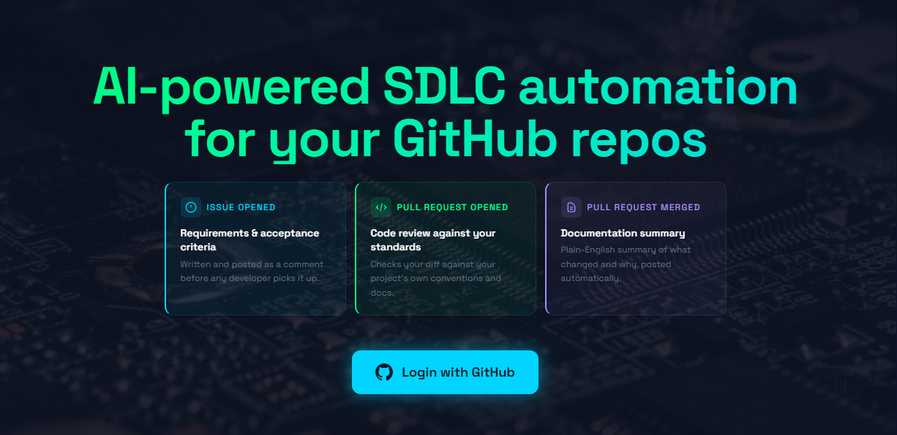

AI-powered GitHub automation that enriches issues, reviews pull requests, and generates documentation — driven by per-user LangGraph agents and a RAG knowledge base.

## What It Does

RepoGator connects to your GitHub repositories and runs AI agents in the background whenever issues or pull requests are opened. Users authenticate with GitHub OAuth, add repositories they own or have access to, and the system automatically installs a per-repo webhook with a unique HMAC secret. From that point forward, events flow through the pipeline without any manual intervention.

Three specialized agents handle different event types. The Requirements Agent processes new issues: it enriches them with structured acceptance criteria, complexity estimates, and clarifying questions posted as a GitHub comment. The Code Review Agent activates on pull requests, analyzing the diff against your project's coding conventions and documentation to produce actionable, context-aware feedback. The Docs Agent generates documentation summaries tied to code changes, keeping your documentation aligned with what actually ships.

Every agent comment includes the exact LLM model identifier used to generate it, so you always know which model produced a given output — whether that's your own configured model or the admin fallback.

Each agent queries the user's personal ChromaDB knowledge base first. If confidence is low or the collection is empty, the agent falls back to a shared default collection. When a repository is added, RepoGator automatically ingests its documentation files (`README.md`, `CONTRIBUTING.md`, `ARCHITECTURE.md`, `SECURITY.md`, `docs/*.md`) into the user's knowledge base in the background, so agents have project context from the start.

Event processing is durable. On container restart, any events with `status=received` are automatically re-queued so nothing is lost between deployments. Every webhook, agent action, and outcome is logged to an append-only audit log.

## Architecture

```
┌─────────────────────────────────────────────────────────────┐
│                     GitHub Repository                        │
│              (Issues, Pull Requests, Events)                 │
└──────────────────────────┬──────────────────────────────────┘
                           │ Webhooks (per-repo HMAC secret)
                           ▼
┌─────────────────────────────────────────────────────────────┐
│                    FastAPI Application                       │
│  POST /webhook/{owner}/{repo} → Verify → DB Log → Queue     │
│  POST /webhook (legacy, global secret)                       │
└──────────────┬────────────────────────────┬─────────────────┘
               │                            │
               ▼                            ▼
┌──────────────────────┐      ┌─────────────────────────────┐
│   LangGraph          │      │      Web UI                  │
│   Orchestrator       │      │   GET /          landing     │
│   (per-user keys)    │      │   GET /dashboard (authed)   │
│                      │      │   GET /repos                 │
│  ┌────────────────┐  │      │   GET /settings              │
│  │Requirements    │  │      │   GET /knowledge             │
│  │Agent (Issues)  │  │      │   GET /privacy               │
│  └────────────────┘  │      │   GET /admin     (admin)    │
│  ┌────────────────┐  │      │   GET /auth/github           │
│  │Code Review     │  │      └─────────────────────────────┘
│  │Agent (PRs)     │  │
│  └────────────────┘  │      ┌─────────────────────────────┐
│  ┌────────────────┐  │      │   Infrastructure             │
│  │Docs Agent      │  │      │  ├── PostgreSQL (DB)        │
│  └────────────────┘  │      │  ├── Redis (job queue)      │
└──────────────────────┘      │  ├── ChromaDB (per-user)    │
                               │  ├── Prometheus (metrics)   │
                               │  ├── Grafana (dashboards)   │
                               │  ├── cAdvisor (containers)  │
                               │  └── nginx (reverse proxy)  │
                               └─────────────────────────────┘
```

## Features

- GitHub OAuth login with incremental scope — minimal permissions at sign-in, `write:repo_hook` requested only when adding a repo
- Automatic webhook installation per repository with unique HMAC secrets
- Three AI agents: Requirements enrichment, Code Review, and Documentation generation
- Model attribution in every agent comment — the exact LLM model identifier is included in each GitHub comment footer
- Per-user ChromaDB knowledge base with strict isolation between users and shared fallback collection
- Auto-ingestion of repository documentation files on repo add
- Manual knowledge base management: upload files (`.md`, `.txt`, `.pdf`) or index any public URL
- Per-user OpenRouter and OpenAI API keys — agent calls billed to the user's own accounts
- Admin fallback keys for users who have not configured their own
- Durable event queue — events are re-queued on restart, no data loss
- Automated data retention — processed events and audit log entries older than a configurable window (default: 90 days) are purged daily
- Append-only audit log for all significant application events
- GDPR right to erasure — users can permanently delete all their data (ChromaDB collections, events, knowledge base, API keys, account) from the Privacy page
- Data export — users can download a JSON summary of all data RepoGator holds about them
- Privacy page with full data transparency: what is stored, where it goes, retention periods, and security practices
- Prometheus metrics with counters, histograms, and gauges for webhooks, agent runs, queue depth, and system resources
- Grafana dashboards for pipeline health, traffic, and container metrics
- Admin dashboard (`/admin`) showing live system health, DB stats, user list, and top repositories

## Tech Stack

| Component | Technology | Purpose |
|-----------|-----------|---------|
| API Server | FastAPI + Uvicorn | Webhook receiver, web UI, health checks |
| Auth | GitHub OAuth + itsdangerous | Signed session cookies, incremental scope |
| Orchestration | LangGraph | Stateful multi-agent workflow |
| LLM | OpenRouter (configurable model) | Agent reasoning and structured output |
| Embeddings | OpenAI text-embedding-3-small | RAG vector search |
| Vector Store | ChromaDB | Per-user knowledge base with shared fallback |
| Job Queue | Redis | Async webhook event processing |
| Database | PostgreSQL + SQLAlchemy | Users, repos, events, knowledge docs, audit log |
| Metrics | Prometheus + Grafana + cAdvisor | Observability, alerting, container metrics |
| Reverse Proxy | nginx | Reverse proxy, SSL termination |
| Containerization | Docker + Docker Compose | Local dev and production deployment |
| CI/CD | GitHub Actions | Automated test, build, push, deploy |

## Multi-Tenant Model

Each user authenticates via GitHub OAuth. The initial OAuth flow requests only `read:user user:email` — no broad repository permissions. When a user adds a repository, RepoGator initiates an incremental authorization to acquire `write:repo_hook` scope, then installs the webhook on GitHub automatically.

Users configure their own OpenRouter and OpenAI API keys in the Settings page. When keys are present, all agent LLM calls and embedding lookups are billed to the user's own accounts. If a user has not set their keys, the system falls back to the admin-level keys configured via the `OPENROUTER_API_KEY` and `OPENAI_API_KEY` environment variables. Events for users without keys and without admin fallback keys will fail with a clear error recorded in the event log.

ChromaDB collections are strictly isolated per user using namespaced collection names. No query can read another user's knowledge base.

The admin user is determined by the `ADMIN_EMAIL` environment variable. Any GitHub account whose primary email matches this value is granted admin status on first login, unlocking the `/admin` dashboard.

## Getting Started (Local Development)

### Prerequisites

- Docker and Docker Compose
- A GitHub OAuth App (see below)
- OpenRouter and OpenAI API keys

### GitHub OAuth App Setup

1. Go to **GitHub → Settings → Developer settings → OAuth Apps → New OAuth App**
2. Set **Authorization callback URL** to `http://localhost:8000/auth/callback`
3. Add **Additional callback URL**: `http://localhost:8000/auth/expand-callback`
4. Copy the **Client ID** and a generated **Client Secret** into your `.env`

### Running Locally

```bash
# 1. Clone the repository
git clone https://github.com/volskyi-dmytro/repogator.git
cd repogator

# 2. Copy and fill in environment variables
cp .env.example .env
# Edit .env — see Environment Variables section below

# 3. Start all services
docker compose up -d

# 4. Ingest the shared knowledge base (one-time setup)
docker exec repogator-app python -m scripts.ingest_knowledge_base

# 5. Verify the app is running
curl http://localhost:8000/health

# 6. Visit http://localhost:8000 and sign in with GitHub
```

### Running Tests

```bash
pip install -r requirements.txt
pytest tests/ -v
```

## Environment Variables

No actual values should be committed to version control. Copy `.env.example` to `.env` and fill in the values below.

| Variable | Description | Required |
|----------|-------------|----------|
| `APP_NAME` | Application display name | No (default: `RepoGator`) |
| `DEBUG` | Enable debug logging | No (default: `false`) |
| `GITHUB_TOKEN` | Admin GitHub token for the legacy `/webhook` endpoint | Yes |
| `GITHUB_WEBHOOK_SECRET` | HMAC secret for the legacy `/webhook` endpoint | Yes |
| `GITHUB_REPO` | Default repository for legacy webhook mode (`owner/repo`) | Yes |
| `DATABASE_URL` | PostgreSQL async connection string (`postgresql+asyncpg://...`) | Yes |
| `REDIS_URL` | Redis connection URL | Yes |
| `OPENROUTER_API_KEY` | Admin-level LLM API key (fallback for users without their own key) | Yes |
| `OPENROUTER_BASE_URL` | OpenRouter base URL | No (default: `https://openrouter.ai/api/v1`) |
| `OPENROUTER_MODEL` | Default LLM model identifier | No (default: `anthropic/claude-3.5-sonnet`) |
| `OPENAI_API_KEY` | Admin-level embeddings API key (fallback for users without their own key) | Yes |
| `OPENAI_EMBEDDING_MODEL` | Embedding model name | No (default: `text-embedding-3-small`) |
| `CHROMADB_HOST` | ChromaDB service hostname | No (default: `localhost`) |
| `CHROMADB_PORT` | ChromaDB service port | No (default: `8001`) |
| `GITHUB_CLIENT_ID` | GitHub OAuth App client ID | Yes |
| `GITHUB_CLIENT_SECRET` | GitHub OAuth App client secret | Yes |
| `SESSION_SECRET_KEY` | Secret for signing session cookies — use `python -c "import secrets; print(secrets.token_hex(32))"` | Yes |
| `APP_BASE_URL` | Public base URL used for webhook callback registration | Yes |
| `ADMIN_EMAIL` | GitHub account email that receives admin privileges on first login | Yes |
| `DATA_RETENTION_DAYS` | Days to retain processed webhook events and audit log entries | No (default: `90`) |
| `GRAFANA_PASSWORD` | Grafana admin password — also used for nginx basic auth in front of `/grafana/` and `/prometheus/` | Yes (prod) |

## Deployment

RepoGator is deployed with Docker Compose behind nginx. The CI/CD pipeline (`.github/workflows/deploy.yml`) runs on every push to `main`:

1. **Test** — runs the full test suite
2. **Build** — builds and pushes the Docker image to Docker Hub
3. **Deploy** — SSHs into the server, syncs config files, pulls the new image, restarts services, and reloads nginx

The deploy step handles:
- Syncing `docker-compose.prod.yml` and `monitoring/` configs via rsync
- Syncing `nginx/repogator.conf` to `/etc/nginx/sites-available/` via `scp` + `sudo mv`
- Generating `/etc/nginx/grafana.htpasswd` from `GRAFANA_PASSWORD` in `.env`
- Starting Prometheus, Grafana, and cAdvisor if not already running
- Running `nginx -t && nginx -s reload` to apply config changes

Required GitHub Actions secrets:

| Secret | Description |
|--------|-------------|
| `DOCKER_USERNAME` | Docker Hub username |
| `DOCKER_PASSWORD` | Docker Hub access token |
| `VPS_HOST` | Hostname or IP of the deployment server |
| `VPS_USER` | SSH username on the deployment server |
| `VPS_SSH_KEY` | Private SSH key for deployment |

For full deployment instructions including nginx configuration, SSL setup, and environment variable management on the server, see `docs/go-live-guide.md`.

## Observability

Prometheus scrapes the application metrics endpoint every 15 seconds. The endpoint is blocked externally by nginx — only accessible from localhost and internal Docker networks. Grafana is available at `/grafana/` and Prometheus at `/prometheus/`, both behind HTTP Basic Auth (username: `admin`, password from `GRAFANA_PASSWORD`). The pre-provisioned dashboard covers:

- Agent runs per minute, success rate %, and p50/p95 latency
- Webhook event volume by event type and repository
- Redis queue depth over time
- Container CPU and memory usage (via cAdvisor)

Alert rules fire when agent failure rate exceeds 20% over 5 minutes, or queue depth exceeds 50 events.

## Privacy and Data Governance

RepoGator includes built-in data governance features accessible to all users at `/privacy`:

- **Data transparency** — a clear breakdown of what is stored, for how long, and where it goes
- **Data export** — download a JSON summary of your profile, repositories, and data counts
- **Account deletion** — permanently erase all data including your ChromaDB knowledge base, webhook history, API keys, and account record; GitHub webhooks are uninstalled automatically as part of the process
- **Automated retention** — processed events and audit log entries are deleted after the configured retention window (default 90 days, set via `DATA_RETENTION_DAYS`)

## License

MIT
